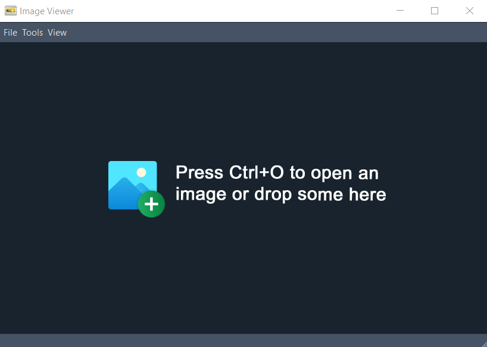
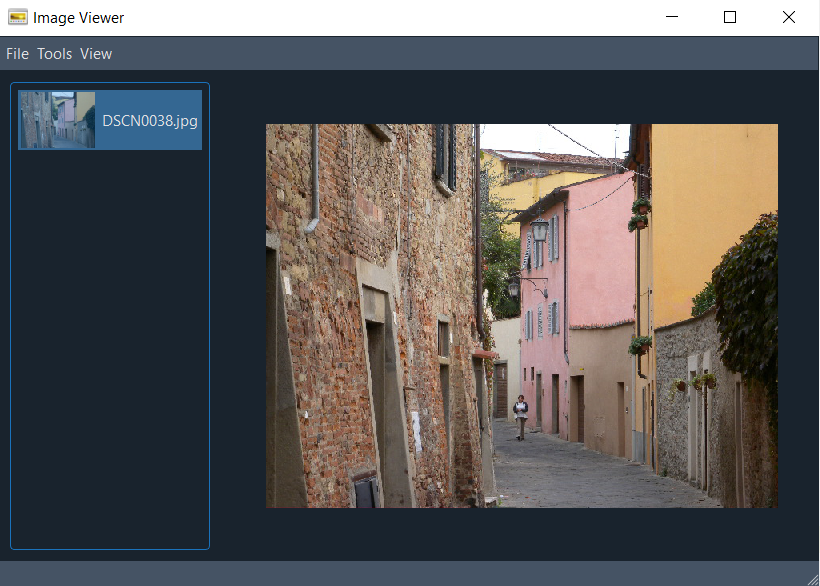
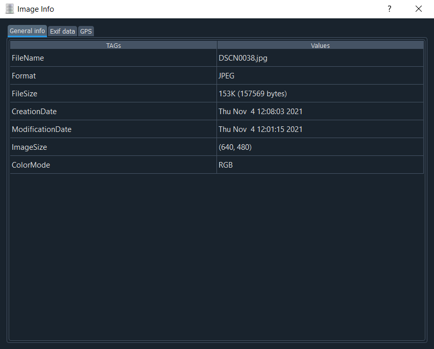
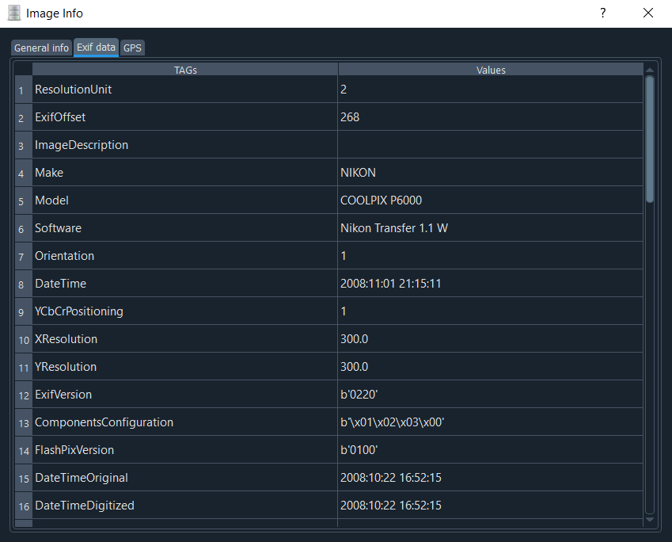
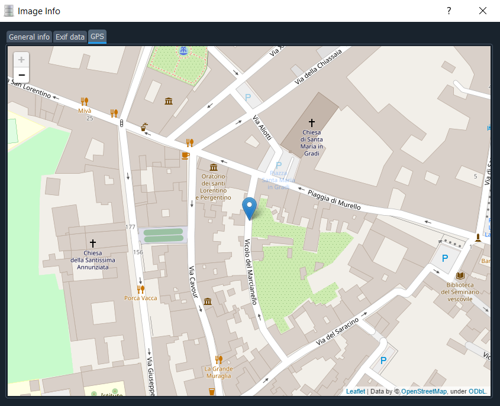
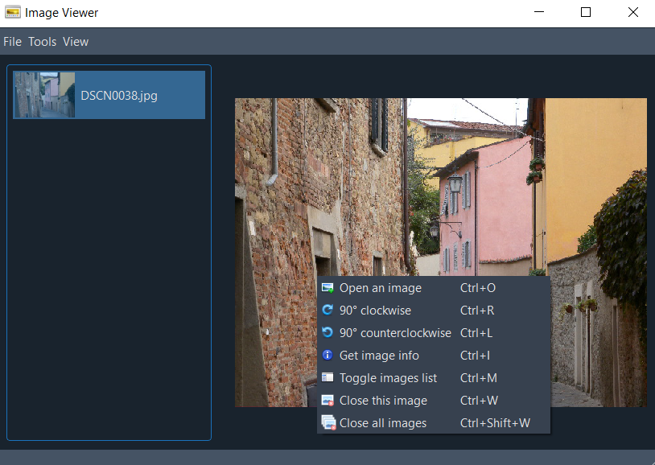

# Image-Viewer
Image Viewer application allows to show and manage png and jpeg files; it is implemented for HCI course at Università degli Studi di Firenze.

## Prerequisites
Package | Version
------- | -------
[Python](https://www.python.org) | 3.8
[PyQt](https://www.riverbankcomputing.com/software/pyqt/download5) | 5.9.2
[Pillow](http://pillow.readthedocs.io/en/latest/index.html) | 8.4.0
[folium](https://pypi.org/project/folium) | 0.12.1
[hurry.filesize](https://pypi.org/project/hurry.filesize) | 0.9
[QDarkStylesheet](https://pypi.org/project/QDarkStyle) | 3.0.2

## Run
From the project's directory run the main.py file in order to start the Image-Viewer:
```
python main.py
```

The MainWindow presents itself like this:




There are some images to test the viewer in the **testing images** folder.

## Overview
Exchangeable image file format (**Exif**) is a standard that specifies the formats for images, sound, and ancillary tags used by digital cameras, smartphones, scanners and other systems handling image and sound files recorded by digital cameras. 
The specification uses the following existing file formats with the addition of specific metadata tags: JPEG for compressed image files, TIFF for uncompressed image files, and RIFF WAV for audio files.
The metadata tags defined in the Exif standard cover a broad spectrum:
 - date and time information. Digital cameras will record the current date and time and save this in the metadata;
 - camera settings. This includes static information such as the camera model and make, and information that varies with each image such as orientation (rotation), aperture, shutter speed, focal length, metering mode, and ISO speed information;
 - a thumbnail for previewing the picture on the camera's LCD screen, in file managers, or in photo manipulation software;
 - each unpopulated location that becomes populated if it has exactly **three** populated neighbors;
 - copyright information.

## Functionalities
In this section are listed all the functions available in the Image-Viewer.

### Open Image
From the starting window a message is displayed to help you load the images and understand what to do, indeed there are three possible ways to do this:
* Use the **hotkey** "Crtl+O";
* **Go to** "File -> Open";
* **Right click** and choose "Open an image".
In the file dialog that appears, you can choose jpeg or png images.
The user can also drag one or more images into the window, in fact if the user drags more than one photo the list below will be filled and the last photo will be uploaded.
The MainWindow will show up as follows:




### Remove Image
Currently viewed images can be **removed** from "File -> Close image(s) -> Current" in the menu bar.

### Remove All Images
All loaded images can be **removed** from "File -> Close image(s) -> All" in the menu bar.

### Rotation
The viewed images can be **rotated** to the right or to the left through "Tools -> 90° clockwise" and "Tools -> 90° counterclockwise" respectively in the menu bar.

### Images List
The **images list** can be used to navigate through the loaded images and can be toggled from "View -> Images list" in the menu bar.
The image to visualize can be updated through a double click or **Enter** key on the thumbnail in the list.

### Get Info
The user can view general information and exif data of the photo displayed in the MainWindow through "View -> Get info" in the menu bar.
The ExifWindow will show up as follows:










**All features are at hand with a right click through a context menu**.

## Keyboard Shortcuts
All features also have a keyboard shortcut for a better interaction.
Functionality | Combination
------- | -------
Open an image | `Ctrl+O`
Remove current image | `Ctrl+W`
Remove all images | `Ctrl+Shift+W`
Rotate Left | `Ctrl+Left Arrow`
Rotate Right | `Ctrl+Right Arrow`
Toggle images list | `Ctrl+M`
Get info | `Ctrl+I`

An example of context menu and shortcuts is shown:



