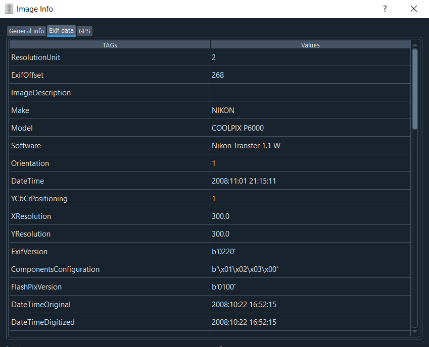
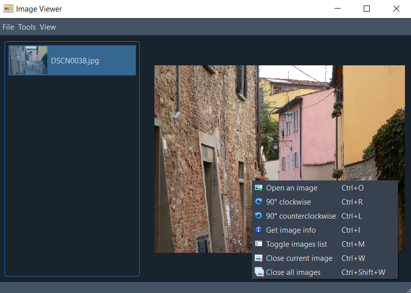

# Image-Viewer
Image Viewer application allows to show and manage png and jpeg files; it is implemented for HCI course at Università degli Studi di Firenze.

## Prerequisites
Package | Version
------- | -------
[Python](https://www.python.org) | 3.8
[PyQt](https://www.riverbankcomputing.com/software/pyqt/download5) | 5.9.2
[Pillow](http://pillow.readthedocs.io/en/latest/index.html) | 8.4.0
[folium](https://pypi.org/project/folium) | 0.12.1
[hurry.filesize](https://pypi.org/project/hurry.filesize) | 0.9
[QDarkStylesheet](https://pypi.org/project/QDarkStyle) | 3.0.2

## Run
From the project's directory run the main.py file in order to start the Image-Viewer:
```
python main.py
```

The MainWindow presents itself like this:


There are some images to test the viewer in the **testing images** folder.

## Exif data
Exchangeable image file format (**Exif**) is a standard that specifies the formats for images, sound, and ancillary tags used by digital cameras, smartphones, scanners and other systems handling image and sound files recorded by digital cameras. 
The specification uses the following existing file formats with the addition of specific metadata tags: JPEG for compressed image files, TIFF for uncompressed image files, and RIFF WAV for audio files.
The metadata tags defined in the Exif standard cover a broad spectrum:
 - date and time information. Digital cameras will record the current date and time and save this in the metadata;
 - camera settings. This includes static information such as the camera model and make, and information that varies with each image such as orientation (rotation), aperture, shutter speed, focal length, metering mode, and ISO speed information;
 - a thumbnail for previewing the picture on the camera's LCD screen, in file managers, or in photo manipulation software;
 - each unpopulated location that becomes populated if it has exactly **three** populated neighbors;
 - copyright information.

## Implementation
The application is based on the *ProjectViewer.py* that is composed by a QMainWindow and a QDialog. The QMainWindow, i.e. **ImageViewer**, allows you to drag and drop some images, open a QFileDialog to select an image to display, rotate all loaded files, get all the information available from them and remove the chosen images. 
The QDialog, i.e. **ExifViewer**, shows all the information available from the current image, that is general information, exif data and the gps map at the point where the image has been taken (only if these information of the image are available).

### Main
In *main.py* there is the singleton model instance **Model** which it is inserted in input for the viewer/controller **ImageViewer** instance, so basically from this python file can be run the whole application.

### Model
The *Model.py* contains the Model class which has all the data necessary for the application to work: indeed it keeps track of the list of images loaded, the list of their names, the current image that is being viewed and two dictionaries that have the information and exif data of the current image.
In addition to the data within the model, there are methods that allow you to use this data such as, for example, functions that fill dictionaries with information and exif data from the current image, functions that set or delete the current image or also delete all the loaded images.

### User Interfaces
The *ImageWindowUI.py* and *ExifWindowUI.py* were created using the QtDesigner software which allows you to create the graphical interface of an application with all the necessary components with which a user can interact such as buttons, labels, menubar or a statusbar.
From the .ui files obtained through this software was generated the python code in order to use these interfaces and to implement the necessary functionality.

### Viewer/Controller
The *ProjectViewer.py* contains the two viewer/controller classes: **ImageViewer** and **ExifViewer**. These two classes are derived class in order to inherits features from the base class where new features can be added to it, in particular the first is derived from a QMainWindow and the second from a QDialog. Methods that implement the functionality of the application were then added to these two classes. For the **ImageViewer**, for example, there are methods that allow you to load images, view a list of all loaded images, remove them all or one at a time, rotate them, resize them while maintaining the aspect ratio so that the width or height is up to 512 pixels, get information from the current image and so on so forth. Through the **ExifViewer** it is possible to display a dialog window containing a table with all the information of the current image, its exif data and the gps map at the point where the image has been taken (only if these information of the current image are available).

### Utils
The *gps_utils.py* contains some useful functions to view and interact with the gps map, calculate the point where the current image has been taken, also allowing a redirection to Google Map in that point for more information.

## Functionalities
In this section are listed all the functions available in the Image-Viewer.

### Open Image
From the starting window a message is displayed to help you load the images and understand what to do, indeed there are three possible ways to do this:
* Use the **hotkey** "Crtl+O";
* **Go to** "File -> Open";
* **Right click** and choose "Open an image".
In the file dialog that appears, you can choose jpeg or png images.
The user can also drag one or more images into the window, in fact if the user drags more than one photo the list below will be filled and the last photo will be loaded.
The MainWindow will show up as follows:


### Remove Image
Currently viewed images can be **removed** from "File -> Close image(s) -> Current" in the menu bar.

### Remove All Images
All loaded images can be **removed** from "File -> Close image(s) -> All" in the menu bar.

### Rotation
The viewed images can be **rotated** to the right or to the left through "Tools -> 90° clockwise" and "Tools -> 90° counterclockwise" respectively in the menu bar.

### Images List
The **images list** can be used to navigate through the loaded images and can be toggled from "View -> Images list" in the menu bar.
The image to visualize can be updated through a double click or **Enter** key on the thumbnail in the list.

### Get Info
The user can view general information and exif data of the photo displayed in the MainWindow through "View -> Get info" in the menu bar.
The ExifWindow will show up as follows:





**All features are at hand with a right click through a context menu**.

## Keyboard Shortcuts
All features also have a keyboard shortcut for a better interaction.
Functionality | Combination
------- | -------
Open an image | `Ctrl+O`
Remove current image | `Ctrl+W`
Remove all images | `Ctrl+Shift+W`
Rotate Left | `Ctrl+Left Arrow`
Rotate Right | `Ctrl+Right Arrow`
Toggle images list | `Ctrl+M`
Get info | `Ctrl+I`

An example of context menu and shortcuts is shown:



